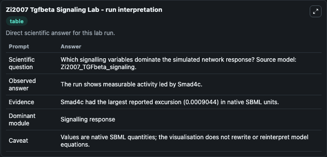
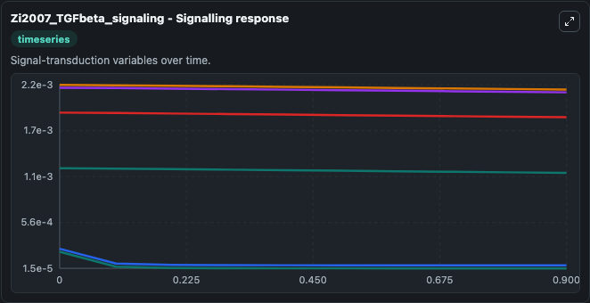
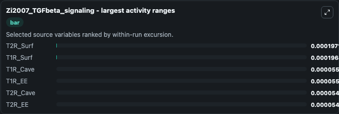
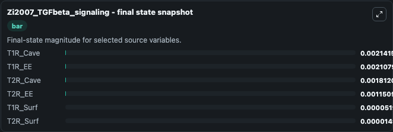
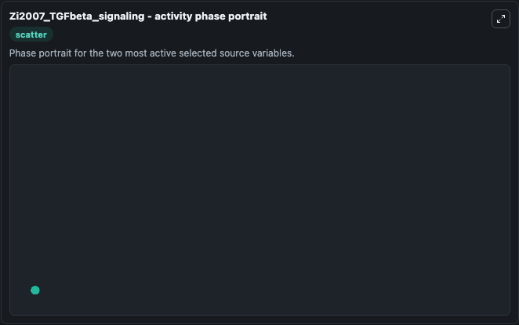

# Zi2007 Tgfbeta Signaling

This Biosimulant lab wraps `Zi2007 Tgfbeta Signaling` as a runnable systems biology model with a companion visualization module.
The model reproduces the time profiles of Total Smad2 in the nucleus as well as the cytoplasm as depicted in 2D and also the other time profiles as depicted in Fig 2. It can be used to explore the configured dynamics and compare scenario outcomes across configurations.

## What You'll See

The lab asks: Which signalling variables dominate the simulated network response? Source model: Zi2007_TGFbeta_signaling. It runs for 1.0 time units with a communication step of 0.1. The run uses the model defaults declared by the curated SBML wrapper. The generated visualizations focus on T1R_Cave, T1R_EE, T2R_Cave, T2R_EE, T1R_Surf, and T2R_Surf, combining trajectory, endpoint-comparison, and summary-table views from one completed dark-mode run.

In this captured run, **T2R_Surf** moved from 0.000212 to 1.5e-05 across 1.0 simulation windows.


### Output Visualizations



*Summary table for Zi2007 Tgfbeta Signaling, reporting the scientific question, observed answer, dominant module, and caveat.*



*Trajectories of T2R_Surf, T1R_Surf, T1R_Cave, T1R_EE, T2R_Cave, and T2R_EE across the 1.0 simulation. In this run **T2R_Surf** fell from 0.000212 to 1.5e-05 — the largest movements among the focused observables.*



*Largest-excursion ranking of the focused observables — the absolute movement magnitude during the run. Top 3: **T2R_Surf** = 0.000197, **T1R_Surf** = 0.000197, **T1R_Cave** = 5.5e-05, with 3 more observables below.*



*Endpoint snapshot of the focused observables — final values from the captured run. Top 3 by value: **T1R_Cave** = 0.00214, **T1R_EE** = 0.00211, **T2R_Cave** = 0.00181, with 3 more observables below.*



*Visualization card from the Zi2007 Tgfbeta Signaling dark-mode run.*


## Model Context

- Core model: `models/core`
- Visualization model: `models/visualisation`
- Standard: `other`
- Upstream source: `biomodels_ebi:BIOMD0000000163`
- License: `CC0`

## Inputs

| Input | Maps To | Default | Notes |
|---|---|---|---|
| Initial T1 R Cave | `systemsbiology_sbml_zi2007_tgfbeta_signaling_biomd0000000163_model.initial_t1_r_cave` | | Source state initial condition exposed as a model-specific control because no explicit intervention parameter is identifiable. Maps to SBML symbol `T1R_Cave`. |
| Initial T1 R Ee | `systemsbiology_sbml_zi2007_tgfbeta_signaling_biomd0000000163_model.initial_t1_r_ee` | | Source state initial condition exposed as a model-specific control because no explicit intervention parameter is identifiable. Maps to SBML symbol `T1R_EE`. |
| Initial T2 R Cave | `systemsbiology_sbml_zi2007_tgfbeta_signaling_biomd0000000163_model.initial_t2_r_cave` | | Source state initial condition exposed as a model-specific control because no explicit intervention parameter is identifiable. Maps to SBML symbol `T2R_Cave`. |
| Initial T2 R Ee | `systemsbiology_sbml_zi2007_tgfbeta_signaling_biomd0000000163_model.initial_t2_r_ee` | | Source state initial condition exposed as a model-specific control because no explicit intervention parameter is identifiable. Maps to SBML symbol `T2R_EE`. |
| Initial T1 R Surf | `systemsbiology_sbml_zi2007_tgfbeta_signaling_biomd0000000163_model.initial_t1_r_surf` | | Source state initial condition exposed as a model-specific control because no explicit intervention parameter is identifiable. Maps to SBML symbol `T1R_Surf`. |
| Initial T2 R Surf | `systemsbiology_sbml_zi2007_tgfbeta_signaling_biomd0000000163_model.initial_t2_r_surf` | | Source state initial condition exposed as a model-specific control because no explicit intervention parameter is identifiable. Maps to SBML symbol `T2R_Surf`. |

## Outputs

| Output | Maps To | Role |
|---|---|---|
| `state` | `systemsbiology_sbml_zi2007_tgfbeta_signaling_biomd0000000163_model.state` | Available to the visualization model and downstream workflows. |
| `summary` | `systemsbiology_sbml_zi2007_tgfbeta_signaling_biomd0000000163_model.summary` | Available to the visualization model and downstream workflows. |
| `species_labels` | `systemsbiology_sbml_zi2007_tgfbeta_signaling_biomd0000000163_model.species_labels` | Available to the visualization model and downstream workflows. |
| `t1_r_cave` | `systemsbiology_sbml_zi2007_tgfbeta_signaling_biomd0000000163_model.t1_r_cave` | Available to the visualization model and downstream workflows. |
| `t1_r_ee` | `systemsbiology_sbml_zi2007_tgfbeta_signaling_biomd0000000163_model.t1_r_ee` | Available to the visualization model and downstream workflows. |
| `t2_r_cave` | `systemsbiology_sbml_zi2007_tgfbeta_signaling_biomd0000000163_model.t2_r_cave` | Available to the visualization model and downstream workflows. |
| `t2_r_ee` | `systemsbiology_sbml_zi2007_tgfbeta_signaling_biomd0000000163_model.t2_r_ee` | Available to the visualization model and downstream workflows. |
| `t1_r_surf` | `systemsbiology_sbml_zi2007_tgfbeta_signaling_biomd0000000163_model.t1_r_surf` | Available to the visualization model and downstream workflows. |
| `t2_r_surf` | `systemsbiology_sbml_zi2007_tgfbeta_signaling_biomd0000000163_model.t2_r_surf` | Available to the visualization model and downstream workflows. |

## Runtime

- Duration: `1.0`
- Communication step: `0.1`

## Running Locally

```bash
biosimulant labs serve
```
